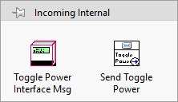

# **VIPM-Personal-Guide**

This is a work in progress guide for writing packages in VIPM, using version control in git.

The main directory looks like this:

- Build folder contains this is the \*.vipb file
- Package folder contains these are the \*.vip files
- Source folder contains the source code such as \*.lvproj and folders with classes / controls / methods

# **Build**

## Process of Building

1. Name the Build in relation to what your git repo is named, with spaces
2. File Directory to choose is the Source folder, as previously mentioned

### Build Information

### Display Information

### Palettes

#### Object Drop Functions Palette

Note the same can be done for the `Controls Palette`, just replace the following `Block Diagram` with `Front Panel`.

Ah, how to have an object drop on the block diagram?

This is simple by
1. creating a \*.vi
2. place the object constant on the block diagram
     
    ***Side Step to updating \*.vi icon***
    1. copy image, paste into Paint program, resize from 48x48 pixels to 32x32 pixels, save as \*.png, go back to LabVIEW \*.vi, edit icon 
    2. `Edit >> Clear All...`
    3. `Edit >> Import Glyph from File...` and selct file
3. Back in build, place this in into the functions palette
     
    *Right click empty space and select `Insert >> Control or VI...`, followed by the \*.vi you just made*
     
    
     
    `Edit VI Title...` to be that of the object name, such as `Class.lvclass`. This occurs since we're using a \*.vi, not \*.lvclass.
     
    `Edit Short Name...` take away the `*.lvclass` extension

# Actor-Specific Packages i.e. Advanced

 
 
 
***Above put interface!!!*** 
Within incoming have two more folders for: 
Within Messages folder:
1. Incoming External (has interface via block diagram as well)
2. Incoming Internal
3. Outgoing External
4. Outgoing Internal

all have the interface object (via block diagram) for reference i.e. interface (left) and corresponding message (right). The necessary interface block diagram `*.vi` gives quick access to the developer what YOUR actor which interface to implement in order to *instantiate (correct word?)* the messages method. 
Further, this established a best practice that a message is coupled to an interface in the palette

Naming convention:
- `methodName Interface Msg.lvclass` (note the use of the word `Interface` which is separated from the scripted `methodName Msg.lvclass`)
- `methodName Interface Msg.lvclass` has ONLY one method: `methodName.vi`, which will be tied to the `methodName Msg.lvclass`

Rule of thumb: 
Messages are ALL tied to an interface
> note: unless the message is internal to the actor, then this message is private in the library

Idea for easier messages..
`methodName Interface.lvclass` internally:
- `methodName.vi (DD)` and
- `methodName Core.vi (DD)`
  - implementation of this method is in override and
  - `methodName Core.vi (DD)` within `methodName.vi (DD)`

The idea:
- `Send methodName ...` scripted here <------------
- `Do.vi` scripted here

maybe in `Msg.lvclass (Interface)`, there are static methods (or dynamic?) that define the behavior for the `Send` and `Do` methods..?

So really, you would ONLY create a *message class* (if it still exists after the above) in an actor when that message is internal for only the actor to use. This is a prime example to use a library becuase this message class, within the actors library, must be marked private so anything outside of the library cannot call these methods.. 
in the future, if the interface message works.. then the interface would be set as an interface.

with an interface message, there is no private data.. SOO that means that there is a cluster (class?) inside the interface which holds the data being carried. 

an interface and class are created, as they normally are with default things inside along with blank controls.. the user just puts in what the name of the message is.. therefore to edit what the data is to be put into the message, the user changes the input settings and then rightclicks the library containing the message and the scripting occurs rewriting everything. except for the controls that you have just put in.

This *may (?)* require the Msg.lvclass to become an interface..

Send.vi internally has the enqueued message internals, with object input (that contains the private data to be passed
